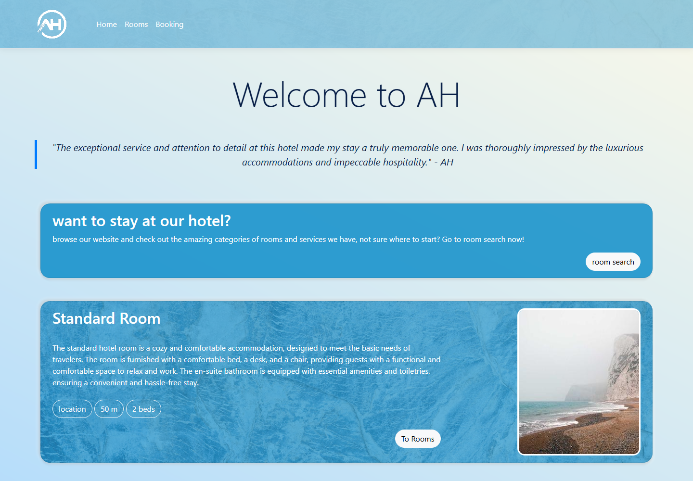

# Hotel Management App

A hotel booking showcase built with ASP.NET Core Razor Pages, a shared C# data-access library, SQL Server database scripts, and a WPF desktop client prototype.

The project demonstrates a full-stack booking flow: room discovery, date-based room search, booking entry, SQL stored procedures, and shared data models that can be reused across web and desktop front ends.

## Screenshots




## Features

- Hotel landing page with room category presentation.
- Date-based room search flow.
- Booking form for guest details.
- SQL Server database project with tables and stored procedures.
- Shared class library for database access and booking models.
- WPF desktop client prototype using the same shared library.

## Tech Stack

- ASP.NET Core Razor Pages
- C#
- SQL Server / T-SQL
- Dapper
- Entity Framework Core package references
- Bootstrap
- WPF

## Project Structure

```text
WebAppHotel/             Main Razor Pages web app
HotelAppClassLibrary/    Shared models and SQL data access
SQLHotelDb/              SQL Server database project
Hotel.Desktop/           WPF desktop prototype
HotelManagementApp.sln   Visual Studio solution
```

## Run Locally

Requirements:

- .NET SDK
- SQL Server or LocalDB if you want to use the database-backed room search

Build the solution:

```powershell
dotnet build HotelManagementApp.sln
```

Run the web app:

```powershell
dotnet run --project WebAppHotel/WebAppHotel.csproj
```

The app reads connection strings from normal ASP.NET Core configuration sources. For local development, set `ConnectionStrings:SqlHotelDbAzure` with user secrets or environment variables.

Example:

```powershell
dotnet user-secrets set "ConnectionStrings:SqlHotelDbAzure" "Server=(localdb)\\MSSQLLocalDB;Database=SQLHotelDb;Trusted_Connection=True;" --project WebAppHotel/WebAppHotel.csproj
```

## Notes

Azure publish profiles and Visual Studio service dependency metadata are intentionally not stored in this public repository. Deployment-specific settings should stay in GitHub Actions secrets, user secrets, or environment variables.

This is a portfolio project and still uses older target frameworks in parts of the solution. A future maintenance pass should move the web and desktop projects to a current .NET LTS version.
